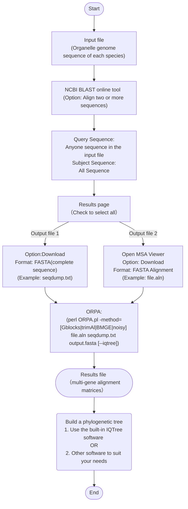

## If you find this useful, please cite:
Guiqi Bi, <br/>　


# What is ORPA? 
　　ORPA is a new and highly efficient pipeline that uses NCBI BLAST result files to construct multi-gene alignments. It can automatically parse the BLAST output and generate multiple sequence alignments for organelle genome comparisons in just five minutes. It can efficiently overcome the challenges of manual operations and large-scale data processing that exist in [HomBlocks](https://github.com/fenghen360/HomBlocks).<br/>
  
　　Organelle genomes aid in constructing phylogenetic trees that reveal the evolutionary relationships between species, especially in cases of incomplete lineage sorting. This approach offers a comprehensive perspective, enabling a more precise assessment of the phylogenetic relationships between species. Phylogenetic trees derived from organelle genome single-copy genes can provide valuable insights into species’ evolutionary history. However, aligning and joining these genes can be challenging and prone to errors. To address this issue, the HomBlocks tool was developed, but it can be slow when working with numerous sequences. To overcome this, a new software called ORPA has been introduced. This method not only ranks as the fastest software for constructing multi-sequence alignments (MSA) of organelle genomes but also delivers exceptionally accurate results compared to HomBlocks. Our research findings offer compelling evidence that ORPA presents a highly viable alternative to HomBlocks, ensuring both superior speed and accuracy. Moreover, ORPA can be employed in systematic investigations to promptly obtain precise evolutionary relationships among species, resulting in significant research discoveries such as species-level evolutionary conflicts.<br/>
## Conventional way for construction of multi-gene alignment from organelle genomes

　　Almost all studies regarding organelle genomics are accustomed to making phylogeny analyses by taking advantage of multiple genes to improve phylogenetic resolution. But usually, every single set of orthologous genes is required to be pre-aligned, and then concatenation will be performed among these commonly aligned genes. Although some software, like Sequence Matrix, can facilitate the procedure of sequence extraction or concatenation, constructing multi-gene alignments derived from organelle genomes is a complex process and prone to induce artificial errors. Despite that, the most concerning point for researchers is how long this alignment procedure will take. In general, with the help of some bioinformatics tools, it will take at least two weeks to make genome-wide alignments using common genes among 30 higher plant chloroplast genomes (about 150 kb long with at least 100 common genes). Thus, the phenomenon that the number of genes used in phylogeny is decreased below 70 is common in papers of plant chloroplast genomes. Researchers have to be patient and cautious because a single-gene alignment with artificial errors can lead to undetectable misplacement in the final alignments. Generally speaking, organelle phylogenomic analysis provides exact tools to detect genetic relationships, but the construction of multi-gene alignments does not sound convenient.<br/>
## Reasons why alignment cannot be established using whole organelle genomes
　　The evolution of organelle genomes is dynamic and diverse in gene content, structure, and sequence divergence. Thus, in basic terms, these genomes cannot be aligned directly using the whole genome sequences as shown by the picture below.<br/>

<br/>

　　This is the result picture of Mauve, which shows the comparison of plastid genomes of three green algae. As we can see, there is a large inverted fragment in Ulva sp. when compared with other sequences (arrow B). The gene content and intergenic region length are also different (arrow C). Similarly, the number of gene introns among the genomes is different (arrow A). The most direct consequence is that they exhibit different lengths (arrow D). For aligners, these characteristics can lead to fatal errors or corruption. <br/>
  
　　Organelle genomes within intraspecies are usually conserved both in length and structure. So, in some cases, they can be aligned directly. But in nine cases out of ten, researches of organelle genomes focus on the interspecies level, which means direct alignment is difficult to realize.<br/>
   
## Methodology
　　As tools for aligning genomes, HomBlocks uses a method of identifying locally collinear blocks (LCBs), while the main difference with ORPA is its strategy of directly parsing the NCBI BLAST online tool results. By avoiding the need for software installation and various dependencies, this approach simplifies genome alignment for novices in the field of bioinformatics.<br/>
  
　　The core of ORPA is based on the widely-used BLAST tool, which offers significant improvements in the efficiency and speed of sequence alignments. Compared to HomBlocks, ORPA can construct alignment files within 5 minutes on average.<br/>
<br/>

　　In contrast, HomBlocks requires an increasing amount of processing time as the number of sequences being aligned grows due to the single-threaded operation of its core software, Mavue. Therefore, ORPA offers a more efficient and versatile alternative to HomBlocks.<br/>

　　ORPA also provides users with four trimming methods, namely Gblocks, trimAl, Noisy, and BMGE, which are the same as those offered by HomBlocks. Importantly, users can directly use the output results from ORPA to facilitate the construction of a phylogenetic tree. The built-in Iqtree option also can be chosen. Thus streamlining the sequence alignment process.<br/>
## Installation
　　The framework of ORPA is written in Perl. No external installation is needed for ORPA. All the dependency's external executable files are placed under the bin directory. git clone https://github.com/fenghen360/ORPA.git or download the zip-compressed files into your work directory.


```bash
# Decompressing files
unzip ORPA-master.zip

# Note that ORPA.pl is the main program, you can check it's usage by
perl ORPA.pl

# Check wether programs in bin directory are executable. if they are not, change their permission.
cd ORPA-master
cd bin
chmod 755 *
```

### Required software

1. perl with version above 5
2. java with version above 1.7 (required by BMGE.jar)
    

## Tutorial
　　ORPA is not complex to use. You need to prepare the relevant organelle sequences into fasta files (fasta, fas, fa), and combine them into one file.
Like these test sequence that were put in **18plant-Chloroplast/all.fasta**.<br/>
The operation steps are shown in the following flowchart and GIF animation

### Running with 18plant-Chloroplast genomes as an example
- **To begin with, use NCBI BLAST online tool to do preliminary processing of sequence files.**
  - 1.Combine all the sequences that you need for building a phylogenetic tree into a single file.<br/>　
    <br/>　
  - 2.Open the NCBI BLAST tool and select the option to align two or more sequences.<br/>　
    <br/>　
  - 3.Use the NCBI BLAST online tool to align one of the 18 plant chloroplast genome sequences as the query sequence with all 18 plant chloroplast genome sequences as the subject sequences.<br/>　
    <br/>　
  - 4.Download the complete sequence seqdump file from NCBI BLAST online tool results (eg:**seqdump.txt**).<br/>　
    <br/>　
  - 5.Download the fasta alignment file from NCBI Multiple Sequence Alignment Viewer (eg:**file.aln**).<br/>　
    <br/>
    <br/>　
If you are unable to open the MSA viewer page window smoothly, please refer to the following operation:<br/>　
&nbsp;&nbsp;&nbsp;&nbsp;&nbsp;&nbsp; 1)Copy the Blast RID number.<br/>　
&nbsp;&nbsp;&nbsp;&nbsp;&nbsp;&nbsp; 2)Open MSA viewer page(https://www.ncbi.nlm.nih.gov/projects/msaviewer/) and choose Upload Options.<br/>　
&nbsp;&nbsp;&nbsp;&nbsp;&nbsp;&nbsp; 3)Paste the Blast RID number and click on Upload.<br/>　
     
     <br/>　
    
**At this step, you can get two files, **file.aln** and **seqdump.tx**t, and then use them as input to the ORPA software.**<br/>
<br/>

- **Secondly, construction of the final multiple sequence comparison matrix or phylogenetic tree using ORPA software.**
  - 1.you can check the usage of ORPA without any parameters. 

    ```
    # check usage
    perl ORPA.pl

    # The print of screen should be like this
    usage: 
              perl ORPA.pl -method=[Gblocks|trimAl|BMGE|noisy] <file.aln> <seqdump.txt> <output.fasta> --iqtree
      or
              perl ORPA.pl -method=[Gblocks|trimAl|BMGE|noisy] <file.aln> <seqdump.txt> <output.fasta>
          
    example:
              perl ORPA.pl -method=trimAl file.aln seqdump.txt output.fasta --iqtree
      or
          perl ORPA.pl -method=trimAl file.aln seqdump.txt output.fasta 
         
    parameters:
               -method=[Gblocks|trimAl|BMGE|noisy]   To choose which program to be used in alignment trimming. (Default: Gblocks).
               <file.aln>                            FASTA alignment file, which is downloaded from NCBI Multiple Sequence Alignment Viewer.
               <seqdump.txt>                         Complete sequence seqdump file,which is download from NCBI BLAST online tool results.
               <output.fasta>                        The final constructed multiple sequence alignment matrix file.
               --iqtree                              Optional, use built-in iqtree to construct phylogenetic tree.
                                                     (Built-in Iqtree operating parameters:-st DNA -nt AUTO -bb 1000 -alrt 1000 -m MFP)
    ```
  - 2.Construction of multiple sequence comparison matrix using ORPA. 
  
    ```bash
    perl ORPA.pl -method=trimAl file.aln seqdump.txt output.fasta
    ```
    
  - 3.Construct the phylogenetic tree using ORPA and its built-in iqtree.
    ```bash
    perl ORPA.pl -method=trimAl file.aln seqdump.txt output.fasta --iqtree
    ```
<br/>

- **Output files.**
  - 1.The most important result.
    ```bash
    perl ORPA.pl -method=trimAl file.aln seqdump.txt output.fasta
    ```
    This run was finished and resulted in an alignment file named "**output.fasta**"**.** Sequences in output.fasta were already aligned and trimmed, you can check it by aligners like MEGA, clustalx, or UGENE, and you can directly use the output.fasta file to construct a phylogenetic tree.<br/>

    
 
  - 2.The MSA sequences trimming temporary results named <file.aln>.temp.html, <file.aln>.temp-gb.htm, Your can review the trimming results through web browser.<br/>
      The results of trimmer Gblocks (default).<br/>
    
    
    
      The results of trimmer trimAl.<br/>
    
    
       
 
  - 2.Results processed using iqtree parameters.
    ```bash
    perl ORPA.pl -method=trimAl file.aln seqdump.txt output.fasta --iqtree
    ```  
    This run was finished and resulted in an alignment file named "**output.fasta**"**.** In addition, a folder named "output.fa_iqtree_results" has been created, which contains the "output.fa.treefile" results file built by the IQ-TREE software. This file can be visualized directly using programs such as FigTree or iTOL. 

    
    
    
    
<br/>

## Advantages
- ### Comparison of tree topologies constructed from ORPA and HomBlocks sequence alignment results.<br/>
　　Both methods exhibited a high degree of consistency in the overall topology of the phylogenetic tree. These findings demonstrate the effectiveness of both methods in generating reliable phylogenetic trees. It is noteworthy that all Multiple Sequence Alignment (MSA) constructions were accomplished within a time frame of fewer than 5 minutes using ORPA.<br/>
  
  - #### 1.Comparison of topology between the HomBlocks tree (left) and the ORPA tree (right) of 52 higher plant chloroplast genomes.
    
    
　　The phylogenetic trees were constructed using maximum likelihood (ML) and Bayesian inference (BI) methods with the HomBlocks alignment (62,101 characters) and the ORPA alignment (90,925 characters), respectively. The support values inferred from RAxML (left) and Bayesian posterior probability (right) are indicated by the numbers on the nodes. Fully resolved nodes are not labeled with numbers. These results provide insights into the comparative performance of the two alignment methods for phylogenetic analysis of chloroplast genomes in higher plants.

  - #### 2.Topology comparison of two phylogenetic trees of 36 xenarthran mitochondrial genomes.


    
    
    
　　The HomBlocks tree (left) and the ORPA tree (right) were constructed using different alignment methods, one with 15,170 characters and the other with 8,696 characters. Maximum likelihood and Bayesian inference methods were used to construct the trees, and the support values derived from RAxML (left) and Bayesian posterior probability (right) are indicated by the numerical values on the nodes. Fully resolved nodes are unlabeled.

  - #### 3.Comparison of phylogenetic trees and alignment methods for 18 higher plant mitochondrial genomes.


    
    
    
　　Two phylogenetic trees of 18 higher plant mitochondrial genomes were constructed using ORPA and HomBlocks alignment methods, respectively. The trees were constructed with maximum likelihood and Bayesian inference methods, and the support values derived from RAxML and Bayesian posterior probability are indicated on each node. Fully resolved nodes are unlabeled.
    
 
　　Distributional differences of phylogenetic alignments obtained from ORPA and HomBlocks methods using Ajuga reptans as the reference sequence. The circos plot illustrates the differing sequence composition sites between the two methods, with green and gray dots indicating the variation between the alignments.

- ### Comparing the Runtime of ORPA and HomBlocks.<br/>
　　To directly compare the runtime differences of ORPA and HomBlocks on the same dataset, we tested 60 higher plant chloroplast genomes. First, we constructed genome-wide alignments using ORPA based on these 60 chloroplast sequences and conducted Maximum likelihood tree reconstruction using IQ-tree . Then, we sampled based on the topology of the tree and compared the runtime of ORPA and HomBlocks. The sampling range increased by 5 with each deepening of evolutionary relationship. Since ORPA typically runs quickly, we standardized the comparison to 1 minute.
  
　　The following figure illustrates a significant increase in runtime for HomBlocks beyond 30 sequences, taking 313 minutes to complete the alignment process. In contrast, the script runtime for ORPA is not affected by the number of sequences, Additionally, the ML tree topologies generated by ORPA and HomBlocks using treedist (https://github.com/agormp/treedist) to check， Except for the comparison group with a sampling range of 25, the similarity between the tree topologies is 91%, indicating almost identical phylogenetic tree topologies generated by ORPA and HomBlocks in the other 11 comparison groups. Therefore, ORPA can potentiallyreplace HomBlocks entirely and become an efficient method for achieving whole-genome alignment.
  
 

　　**Comparison of ORPA and HomBlocks runtime efficiency**. **a**, Comparison of runtime for 60 higher plant chloroplast datasets. A maximum likelihood tree shows the evolutionary relationship among 60 samples. Nodes with 100% support are unspecified, and other partially supported nodes are labeled with bootstrap and aLTR values. Sampling begins at the base of the tree and proceeds with increasing sample sizes of 5 until all data are used, resulting in a total of 12 comparison groups. **b**, Comparison of ORPA and HomBlocks runtime. Sample size corresponds to the sampling range in Figure 5a. The percentage on the bar chart represents the similarity in systemic tree topology generated by the two software programs.


- ### Using ORPA for rapid detection of systematic evolutionary conflicts.<br/>
　　Advancements in sequencing technology have led to the accumulation of a vast amount of organellar genome data. Effective utilization of this data has become a growing field of interest. This is especially important for newly sequenced data, as rapid confirmation of species' evolutionary relationships is crucial in order to verify sequencing accuracy. Additionally, constructing phylogenetic trees with speed and accuracy to investigate evolutionary conflicts is a key area of research in systematics biology. ORPA offers an elegant approach to achieving these goals.<br/>
　　Using ORPA, we aligned 101,454 characters and made a phylogenetic tree to show the evolutionary relationships. The tree reveals two conflicts in the branches for Wightia speciosissima and Comoranthus minor.<br/>
  
  - #### 1.Identification of Wightia speciosissima evolutionary conflicts using ORPA <br/>
　　Wightia speciosissima, an angiosperm, has been assigned to a distinct family (Wightiaceae) by the Angiosperm Phylogeny Group IV . Its previous classification placed it within the Paulowniaceae family. However, the evolutionary branching built using ORPA suggests that it shares closer evolutionary relationships with the Phrymaceae family, thus representing a distinct lineage. This observation was also made by [Xia et al](https://www.frontiersin.org/articles/10.3389/fpls.2019.00528/full)，they advise against including Wightia speciosissima in the Paulowniaceae family and suggest that it may instead be a hybrid origin between early lineages of  Phrymaceae and Paulowniaceae.<br/>
    


　　A total of 18 Lamiales chloroplast trees were constructed using 101,544 characters from the ORPA alignment. Maximum likelihood and Bayesian inference methods were used to construct the trees, and the support values derived from RAxML (left) and Bayesian posterior probability (right) are indicated by numerical values on the nodes. Fully resolved nodes are indicated by red dots. Wightia speciosissima, which has a controversial position in Lamiales, is labeled in red.<br/>
    
  - #### 2.Identification of Comoranthus minor evolutionary conflicts using ORPA 
　　The red phylogenetic branch reveals the incongruity between the genera Comoranthus and Schrebera in terms of their phylogenetic relationships. Both genera have similar fruit morphology, as shown in the species photos below, the evolutionary relationships among the species reveal a paraphyletic relationship, with Comoranthus nested within Schrebera. This outcome is consistent with recent findings by [Hong-Wa et al](https://apps.crossref.org/pendingpub/pendingpub.html?doi=10.1093%2Fbotlinnean%2Fboad004). who suggest that the genera should be synonymized. Incorporating this finding into taxonomic classification will aid in a more accurate understanding of the evolutionary history of these plant groups.
    

　　A total of 52 Lamiales chloroplast trees were constructed using 101,544 characters from the ORPA alignment. Maximum likelihood and Bayesian inference methods were used to construct the trees, and the support values derived from RAxML (left) and Bayesian posterior probability (right) are indicated by numerical values on the nodes. Fully resolved nodes are indicated by red dots.The morphology of four species from the Schrebera and Comoranthus genera is shown on the right side of the figure. Additionally, the results reveal a paraphyletic relationship, with Comoranthus minor nested within Schrebera, leading to the synonymization of these genera.<br/>

　　In summary, ORPA benefits from its ability to rapidly construct phylogenetic trees, which gives it considerable promise in the realm of systematic taxonomy, as shown by the previous use cases.

## Notes


## Acknowledgements


